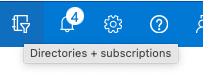
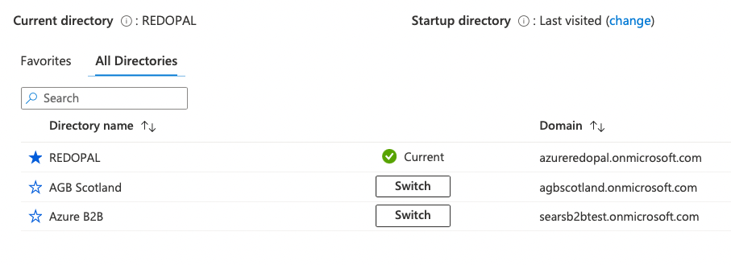

# Login 

## Resources to static-webapp-login:

 

- ### [Static Web App](https://ashy-beach-0122fe903.1.azurestaticapps.net)

- ### [Devops Repo](https://dev.azure.com/redOpalAzure/Playground/_git/static-webapp-login)


- [agbscotland.onmicrosoft.com](https://portal.azure.com/#@azureredopal.onmicrosoft.com/resource/subscriptions/3d2f6870-ef42-4a17-8d4b-02f69f6230bd/resourceGroups/agb/providers/Microsoft.AzureActiveDirectory/b2cDirectories/agbscotland.onmicrosoft.com/b2ctenantresourceoverviewid)

---
- navigate on top menu toolbar and choose Directories + subscriptions icon
 



- switch to AGB SCOTLAND 




- navigate to Azure AD B2C
- on left handside choose App Registration

- registrated app
```bash
AGB STATIC WEB APP
```

