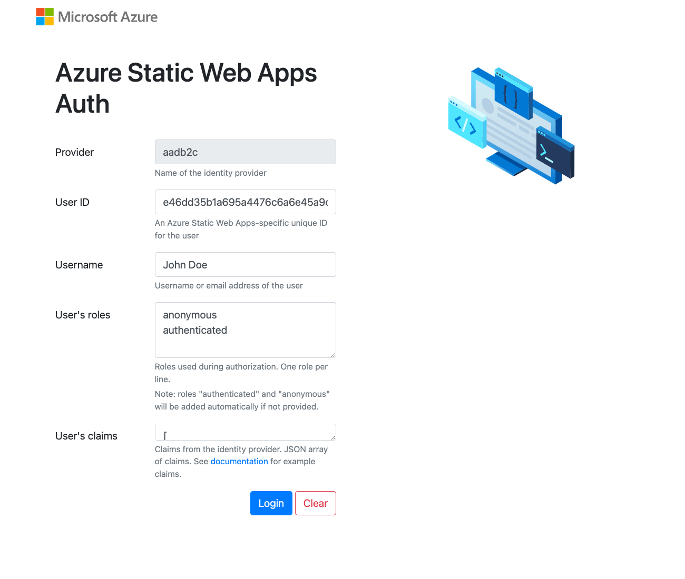

#  Static Webapp Custom Login 


# :clipboard:  GET STARTED

1. Clone repo
    ```sh
   
   ```
1. NPM install dependencies

   ```sh
    npm install
   ```

   you will install: 

   ```bash
   "@angular/animations": "^14.0.0",
    "@angular/cdk": "^14.0.3",
    "@angular/common": "^14.0.0",
    "@angular/compiler": "^14.0.0",
    "@angular/core": "^14.0.0",
    "@angular/forms": "^14.0.0",
    "@angular/material": "^14.0.3",
    "@angular/platform-browser": "^14.0.0",
    "@angular/platform-browser-dynamic": "^14.0.0",
    "@angular/router": "^14.0.0",
    "@microsoft/microsoft-graph-client": "^3.0.4",
    "boxicons": "^2.1.2",
    "primeflex": "^3.2.1",
    "rxjs": "~7.5.0",
    "tslib": "^2.3.0",
    "zone.js": "~0.11.4"
   ```

 1. [Create Azure Static Web app](https://learn.microsoft.com/en-us/azure/static-web-apps/getting-started?tabs=angular)

     - [How to crate SWA in Azure Pdortal](https://learn.microsoft.com/en-us/azure/static-web-apps/get-started-portal?tabs=angular&pivots=github#create-a-static-web-app)
     - [Deploying to Azure Static Web App GitHub](https://docs.github.com/en/actions/deployment/deploying-to-your-cloud-provider/deploying-to-azure/deploying-to-azure-static-web-app)

    -  [Deploying to Azure Static Web App GitHub Azure DevOps](https://dotnetthoughts.net/deploying-a-static-webapp-via-azure-devops-pipeline/)

    - We will generate YML file like:

        ```sh
          static-web-app.yml
        ```
        
1. Run the SWA in development auth mode

    -  will build the App and run Azure Static Web Apps emulator started at http://localhost:4280.  App will run from dist folder.  

   ```sh
     npm run start:dev
   ```

    - User's claims
   
    ```sh

       [
            {
               "typ": "emails",
               "val": "john.doe@gmail.com"
            },
            {
               "typ": "name",
               "val": "John"
            },
            {
               "typ": "extension_Role",
               "val": "Contractor"
            },
            {
               "typ": "extension_CompanyName",
               "val": "John & Sons Builders"
            },
            {
               "typ": "jobTitle",
               "val": "Roofer"
            },
            {
               "typ": "extension_Mobile",
               "val": "07452459643"
            }
     ]   
   ```


   


1. Conecting to Azure AD B2C
   - What is [What is Azure Active Directory B2C?](https://learn.microsoft.com/en-gb/azure/active-directory-b2c/overview)
   - [Set up sign in for a single-page app using Azure Active Directory B2C](https://learn.microsoft.com/en-gb/azure/active-directory-b2c/quickstart-single-page-app)
   - How to create [Azure Active Directory B2C tenant](https://learn.microsoft.com/en-gb/azure/active-directory-b2c/tutorial-create-tenant)
   - [Register a web application in Azure Active Directory B2C](https://learn.microsoft.com/en-gb/azure/active-directory-b2c/tutorial-register-applications?tabs=app-reg-ga)

   - [Create user flows and custom policies in Azure Active Directory B2C](https://learn.microsoft.com/en-gb/azure/active-directory-b2c/tutorial-create-user-flows?pivots=b2c-user-flow)


1. [Configure authentication in an Azure Static Web App by using Azure AD B2](https://learn.microsoft.com/en-gb/azure/active-directory-b2c/configure-authentication-in-azure-static-app)

   In folder bellow we provide the **AADB2C_PROVIDER_CLIENT_ID**  &  **AADB2C_PROVIDER_CLIENT_SECRET**

   ```sh
    staticwebapp.config.json
   ```
 
    ```sh
      {
         "routes": [
            {
               "route": "/home",
               "allowedRoles": [
               "authenticated"
               ]
            }
         ],
         "navigationFallback": {
            "rewrite": "/index.html",
            "exclude": [
               "*.{css,scss,js,png,gif,ico,jpg,svg}"
            ]
         },
         {
            "auth": {
               "identityProviders": {
                  "customOpenIdConnectProviders": {
                  "aadb2c": {
                     "registration": {
                        "clientIdSettingName": "AADB2C_PROVIDER_CLIENT_ID",
                        "clientCredential": {
                        "clientSecretSettingName": "AADB2C_PROVIDER_CLIENT_SECRET"
                        },
                        "openIdConnectConfiguration": {
                        "wellKnownOpenIdConfiguration": "https://<TENANT_NAME>.b2clogin.com/<TENANT_NAME>.onmicrosoft.com/<POLICY_NAME>/v2.0/.well-known/openid-configuration"
                        }
                     },
                     "login": {
                        "nameClaimType": "http://schemas.xmlsoap.org/ws/2005/05/identity/claims/name",
                        "scopes": [],
                        "loginParameterNames": []
                     }
                  }
                  }
               }
            }
         }
      }
   
   ```

   -  [What is your TENANT_NAME?](https://learn.microsoft.com/en-gb/azure/active-directory-b2c/tenant-management#get-your-tenant-name)
   -  [What is POLICY_NAME?](https://learn.microsoft.com/en-gb/azure/active-directory-b2c/tutorial-create-user-flows?pivots=b2c-user-flow)


1. [Azure Active Directory B2C code samples](https://learn.microsoft.com/en-gb/azure/active-directory-b2c/integrate-with-app-code-samples)